# CIA-SIE Application Architecture Flowcharts

> **Chart Intelligence Auditor & Signal Intelligence Engine**
> Professional Architecture Documentation

---

## Table of Contents

1. [High-Level System Architecture](#1-high-level-system-architecture)
2. [Data Model Entity Relationship](#2-data-model-entity-relationship)
3. [Signal Ingestion Flow](#3-signal-ingestion-flow)
4. [Contradiction & Confirmation Detection](#4-contradiction--confirmation-detection)
5. [AI Narrative Generation Pipeline](#5-ai-narrative-generation-pipeline)
6. [Zerodha Kite OAuth Integration](#6-zerodha-kite-oauth-integration)
7. [Constitutional Rules Decision Tree](#7-constitutional-rules-decision-tree)
8. [API Endpoint Structure](#8-api-endpoint-structure)
9. [Complete User Journey](#9-complete-user-journey)
10. [Component Dependency Graph](#10-component-dependency-graph)

---

## 1. High-Level System Architecture

### C4 Context Diagram

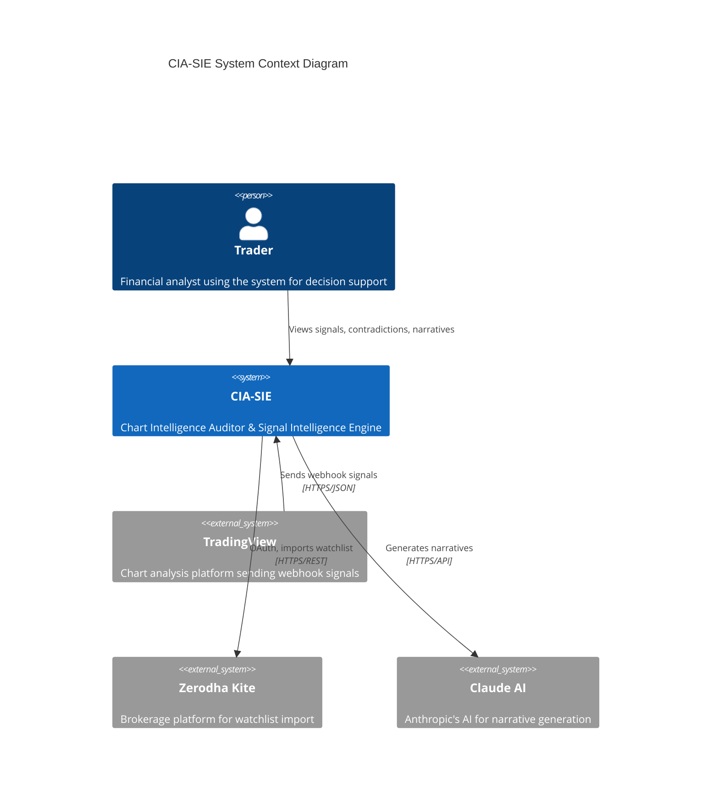

### Layered Architecture

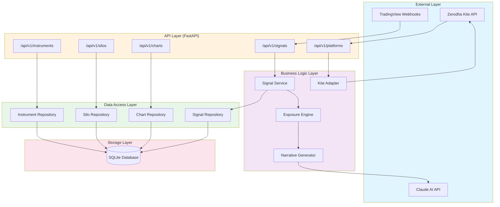

---

## 2. Data Model Entity Relationship

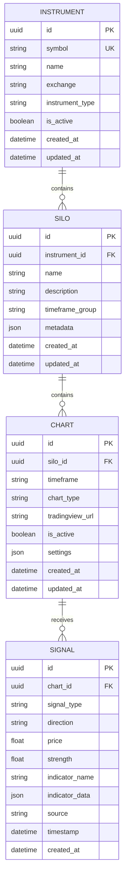

### Hierarchy Visualization

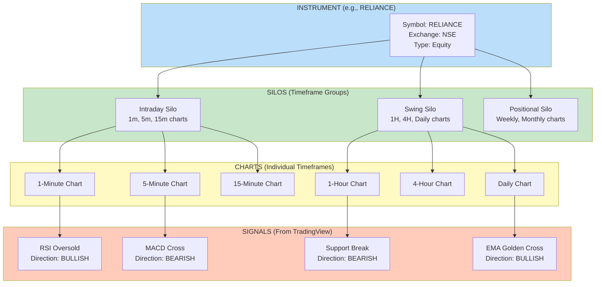

---

## 3. Signal Ingestion Flow

### Sequence Diagram

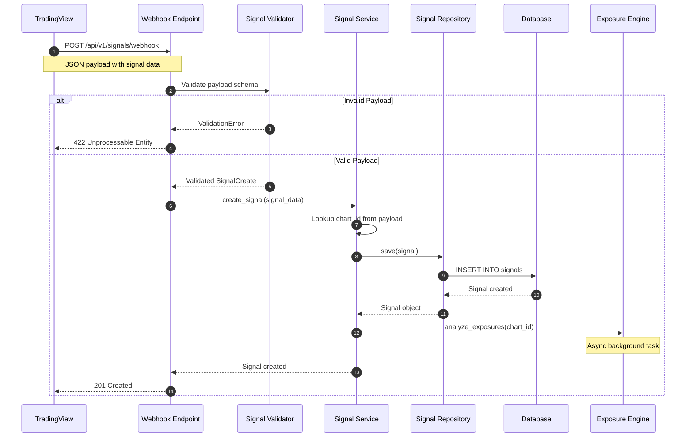

### Signal Processing Pipeline

```mermaid
flowchart LR
    subgraph Input["Signal Input"]
        RAW[Raw Webhook<br/>JSON Payload]
    end

    subgraph Validation["Validation Stage"]
        SCHEMA[Schema Validation<br/>Pydantic Models]
        ENUM[Enum Validation<br/>signal_type, direction]
        REF[Reference Validation<br/>chart_id exists?]
    end

    subgraph Processing["Processing Stage"]
        ENRICH[Data Enrichment<br/>Add timestamps, IDs]
        NORM[Normalization<br/>Standardize values]
    end

    subgraph Storage["Storage Stage"]
        PERSIST[Persist to DB<br/>Signal Repository]
    end

    subgraph Analysis["Analysis Stage"]
        EXPOSE[Exposure Engine<br/>Contradiction Check]
        NARR[Narrative Trigger<br/>If needed]
    end

    RAW --> SCHEMA
    SCHEMA --> ENUM
    ENUM --> REF
    REF --> ENRICH
    ENRICH --> NORM
    NORM --> PERSIST
    PERSIST --> EXPOSE
    EXPOSE --> NARR

    style Input fill:#e3f2fd
    style Validation fill:#fff8e1
    style Processing fill:#f3e5f5
    style Storage fill:#e8f5e9
    style Analysis fill:#ffebee
```

---

## 4. Contradiction & Confirmation Detection

### Detection Logic Flowchart

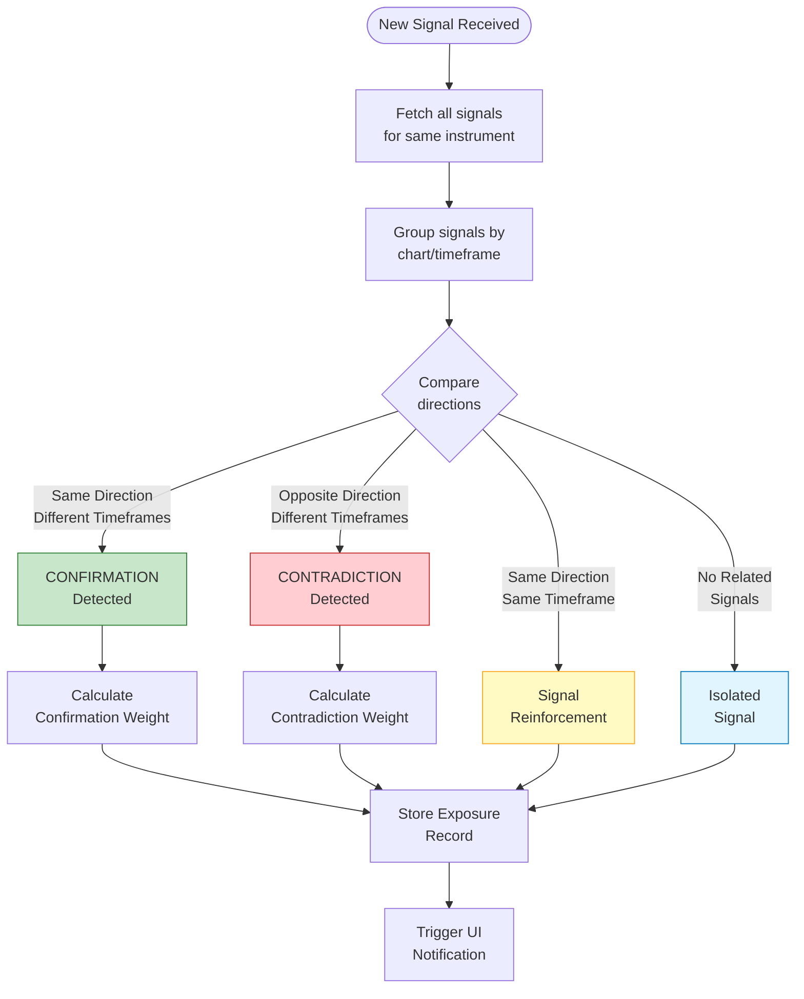

### Exposure Engine State Machine

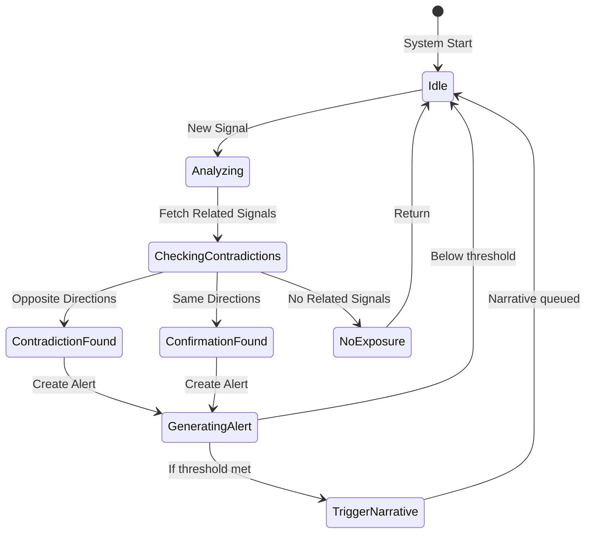

### Contradiction Example

```mermaid
flowchart LR
    subgraph Daily["Daily Chart"]
        D_SIG[EMA Golden Cross<br/>Direction: BULLISH<br/>Strength: 0.8]
    end

    subgraph Hourly["1-Hour Chart"]
        H_SIG[RSI Overbought<br/>Direction: BEARISH<br/>Strength: 0.7]
    end

    subgraph FiveMin["5-Min Chart"]
        M_SIG[MACD Bearish Cross<br/>Direction: BEARISH<br/>Strength: 0.6]
    end

    D_SIG -.->|CONTRADICTS| H_SIG
    D_SIG -.->|CONTRADICTS| M_SIG
    H_SIG -->|CONFIRMS| M_SIG

    subgraph Result["Exposure Result"]
        RES[Mixed Signal State<br/>Long-term: Bullish<br/>Short-term: Bearish<br/>⚠️ CONTRADICTION ALERT]
    end

    D_SIG --> Result
    H_SIG --> Result
    M_SIG --> Result

    style D_SIG fill:#c8e6c9
    style H_SIG fill:#ffcdd2
    style M_SIG fill:#ffcdd2
    style Result fill:#fff3e0
```

---

## 5. AI Narrative Generation Pipeline

### Generation Flow

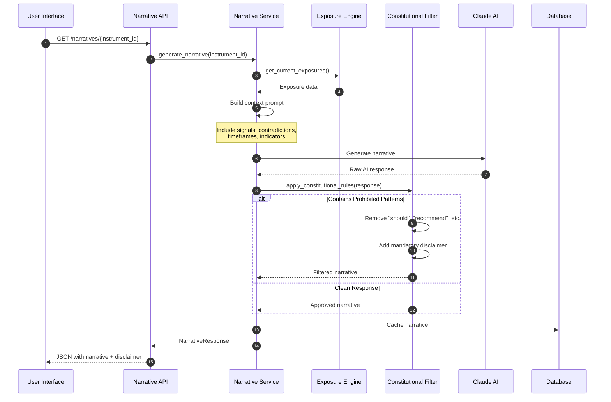

### Constitutional Filtering Pipeline

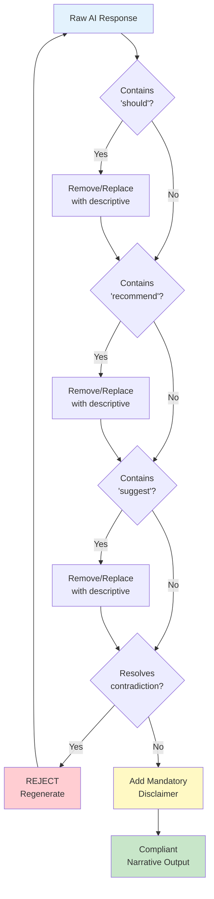

---

## 6. Zerodha Kite OAuth Integration

### OAuth Flow Sequence

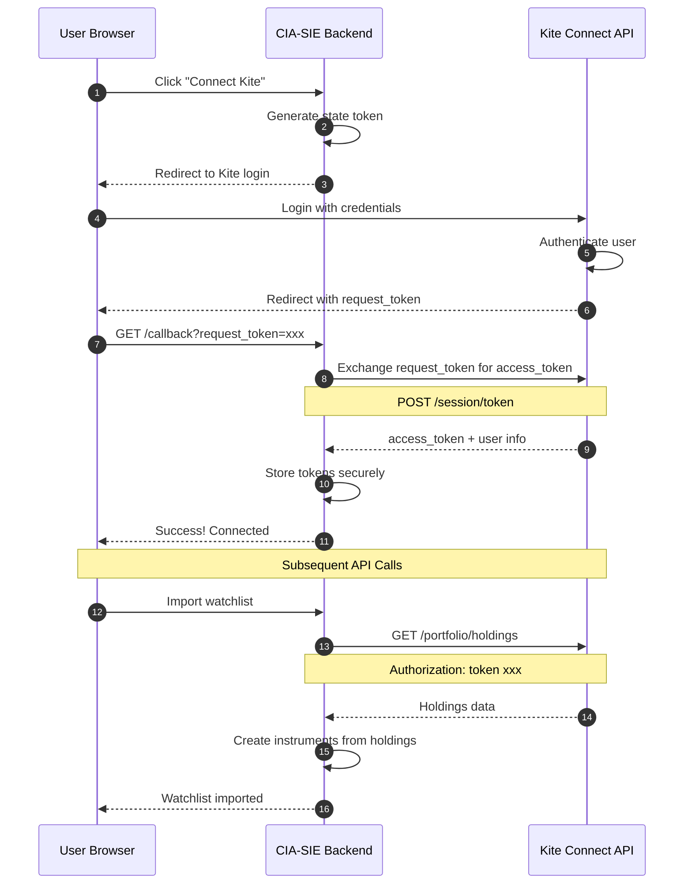

### Kite Integration State Diagram

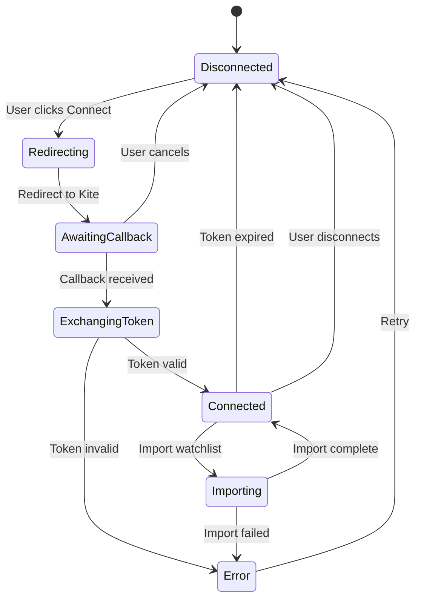

---

## 7. Constitutional Rules Decision Tree

### Rule 1: Decision-Support NOT Decision-Making

```mermaid
flowchart TD
    INPUT[AI Output Text] --> SCAN1{Contains<br/>'should'?}

    SCAN1 -->|Yes| FAIL1[❌ VIOLATION<br/>Rule 1]
    SCAN1 -->|No| SCAN2{Contains<br/>'recommend'?}

    SCAN2 -->|Yes| FAIL1
    SCAN2 -->|No| SCAN3{Contains<br/>'suggest'?}

    SCAN3 -->|Yes| FAIL1
    SCAN3 -->|No| SCAN4{Contains<br/>'must'?}

    SCAN4 -->|Yes| FAIL1
    SCAN4 -->|No| SCAN5{Contains<br/>'buy/sell<br/>imperative'?}

    SCAN5 -->|Yes| FAIL1
    SCAN5 -->|No| PASS1[✅ PASS<br/>Rule 1]

    FAIL1 --> REWRITE[Rewrite as<br/>descriptive statement]
    REWRITE --> INPUT

    style FAIL1 fill:#ffcdd2
    style PASS1 fill:#c8e6c9
    style REWRITE fill:#fff9c4
```

### Rule 2: Expose Contradictions, NEVER Resolve

```mermaid
flowchart TD
    CONTRA[Contradiction<br/>Detected] --> DISPLAY{How to<br/>display?}

    DISPLAY --> EQUAL[Equal Visual Weight<br/>Both directions shown]
    DISPLAY --> UNEQUAL[One direction<br/>emphasized]

    EQUAL --> CHECK_RES{Does AI<br/>resolve it?}
    UNEQUAL --> FAIL2[❌ VIOLATION<br/>Rule 2]

    CHECK_RES -->|"'Despite X, Y is stronger'"| FAIL2
    CHECK_RES -->|"'X exists, Y also exists'"| PASS2[✅ PASS<br/>Rule 2]

    FAIL2 --> REBALANCE[Rebalance to<br/>equal weight]
    REBALANCE --> EQUAL

    style FAIL2 fill:#ffcdd2
    style PASS2 fill:#c8e6c9
    style EQUAL fill:#e8f5e9
    style UNEQUAL fill:#ffcdd2
```

### Rule 3: Descriptive AI, NOT Prescriptive

```mermaid
flowchart TD
    NARRATIVE[AI Narrative] --> HAS_DISC{Has<br/>Disclaimer?}

    HAS_DISC -->|No| ADD_DISC[Add Mandatory<br/>Disclaimer]
    HAS_DISC -->|Yes| CHECK_TONE{Tone<br/>Check}

    ADD_DISC --> CHECK_TONE

    CHECK_TONE --> DESCRIPTIVE["'RSI is at 75'<br/>'MACD crossed'"]
    CHECK_TONE --> PRESCRIPTIVE["'RSI suggests overbought'<br/>'MACD indicates buy'"]

    DESCRIPTIVE --> PASS3[✅ PASS<br/>Rule 3]
    PRESCRIPTIVE --> FAIL3[❌ VIOLATION<br/>Rule 3]

    FAIL3 --> CONVERT[Convert to<br/>pure description]
    CONVERT --> DESCRIPTIVE

    style PASS3 fill:#c8e6c9
    style FAIL3 fill:#ffcdd2
    style ADD_DISC fill:#fff9c4
    style DESCRIPTIVE fill:#e8f5e9
    style PRESCRIPTIVE fill:#ffcdd2
```

### Allowed vs Prohibited Language

```mermaid
flowchart LR
    subgraph Prohibited["❌ PROHIBITED"]
        P1["'You should buy'"]
        P2["'We recommend selling'"]
        P3["'This suggests going long'"]
        P4["'The indicator says buy'"]
        P5["'Despite bearish signals,<br/>bullish trend is stronger'"]
    end

    subgraph Allowed["✅ ALLOWED"]
        A1["'RSI is at 30'"]
        A2["'Price crossed above EMA'"]
        A3["'MACD histogram is positive'"]
        A4["'Daily shows bullish,<br/>hourly shows bearish'"]
        A5["'Volume increased 50%'"]
    end

    style Prohibited fill:#ffcdd2
    style Allowed fill:#c8e6c9
```

---

## 8. API Endpoint Structure

### Endpoint Hierarchy

```mermaid
flowchart TD
    ROOT["/api/v1"] --> INST["/instruments"]
    ROOT --> SILO["/silos"]
    ROOT --> CHART["/charts"]
    ROOT --> SIG["/signals"]
    ROOT --> PLAT["/platforms"]

    INST --> INST_LIST["GET / - List all"]
    INST --> INST_CREATE["POST / - Create"]
    INST --> INST_GET["GET /{id} - Get one"]
    INST --> INST_UPDATE["PUT /{id} - Update"]
    INST --> INST_DELETE["DELETE /{id} - Delete"]
    INST --> INST_SILOS["GET /{id}/silos - Get silos"]

    SILO --> SILO_LIST["GET / - List all"]
    SILO --> SILO_CREATE["POST / - Create"]
    SILO --> SILO_GET["GET /{id} - Get one"]
    SILO --> SILO_CHARTS["GET /{id}/charts - Get charts"]

    CHART --> CHART_LIST["GET / - List all"]
    CHART --> CHART_CREATE["POST / - Create"]
    CHART --> CHART_GET["GET /{id} - Get one"]
    CHART --> CHART_SIGNALS["GET /{id}/signals - Get signals"]

    SIG --> SIG_LIST["GET / - List all"]
    SIG --> SIG_WEBHOOK["POST /webhook - TradingView"]
    SIG --> SIG_GET["GET /{id} - Get one"]

    PLAT --> KITE_LOGIN["GET /kite/login - Start OAuth"]
    PLAT --> KITE_CALLBACK["GET /kite/callback - OAuth callback"]
    PLAT --> KITE_STATUS["GET /kite/status - Check connection"]
    PLAT --> KITE_IMPORT["POST /kite/import - Import watchlist"]

    style ROOT fill:#e3f2fd
    style INST fill:#fff9c4
    style SILO fill:#f3e5f5
    style CHART fill:#e8f5e9
    style SIG fill:#ffccbc
    style PLAT fill:#b2dfdb
```

### Request/Response Flow

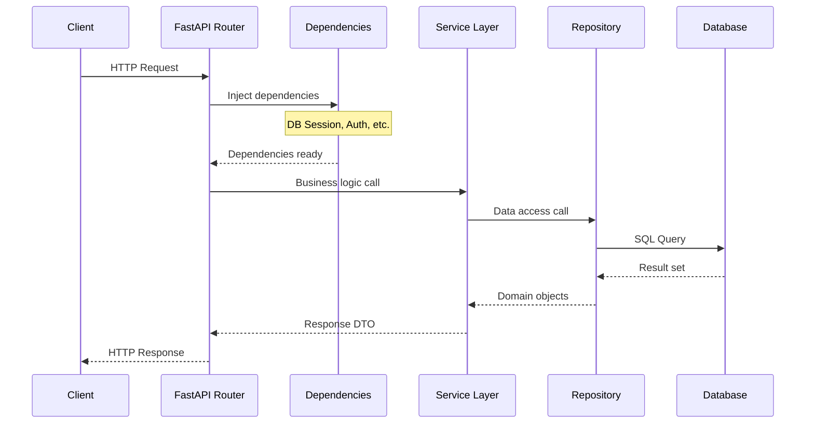

---

## 9. Complete User Journey

### End-to-End State Diagram

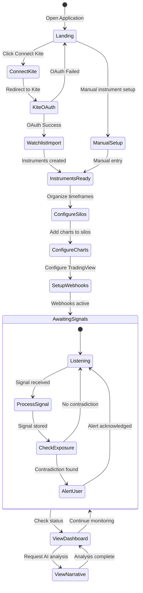

### User Journey Flowchart

```mermaid
flowchart TD
    START([User Opens App]) --> CONNECT{Connect<br/>Kite?}

    CONNECT -->|Yes| OAUTH[Complete Kite<br/>OAuth Flow]
    CONNECT -->|No| MANUAL[Manual Instrument<br/>Entry]

    OAUTH --> IMPORT[Import Watchlist<br/>from Kite]
    IMPORT --> INSTRUMENTS[Instruments<br/>Created]
    MANUAL --> INSTRUMENTS

    INSTRUMENTS --> SILOS[Create Silos<br/>Group by Timeframe]

    SILOS --> CHARTS[Add Charts<br/>to Each Silo]

    CHARTS --> WEBHOOKS[Configure TradingView<br/>Webhooks]

    WEBHOOKS --> LIVE[System Goes Live<br/>Awaiting Signals]

    LIVE --> SIGNAL[Signal Received<br/>from TradingView]

    SIGNAL --> PROCESS[Signal Processed<br/>& Stored]

    PROCESS --> EXPOSURE{Exposure<br/>Check}

    EXPOSURE -->|Contradiction| ALERT[⚠️ Contradiction<br/>Alert Displayed]
    EXPOSURE -->|Confirmation| CONFIRM[✅ Confirmation<br/>Indicator]
    EXPOSURE -->|Isolated| STORE[Signal Stored<br/>No Alert]

    ALERT --> DASH[View Dashboard]
    CONFIRM --> DASH
    STORE --> DASH

    DASH --> NARRATIVE{Request AI<br/>Narrative?}

    NARRATIVE -->|Yes| GENERATE[Generate Narrative<br/>with Disclaimer]
    NARRATIVE -->|No| LIVE

    GENERATE --> READ[Read Descriptive<br/>Analysis]
    READ --> DECIDE[User Makes<br/>Own Decision]
    DECIDE --> LIVE

    style START fill:#e3f2fd
    style ALERT fill:#ffcdd2
    style CONFIRM fill:#c8e6c9
    style GENERATE fill:#fff9c4
    style DECIDE fill:#e8f5e9
```

---

## 10. Component Dependency Graph

### Module Dependencies

```mermaid
flowchart TD
    subgraph API["API Layer"]
        APP[app.py<br/>FastAPI Application]
        ROUTES[routes/<br/>Endpoint Definitions]
        DEPS[dependencies.py<br/>Dependency Injection]
    end

    subgraph Services["Service Layer"]
        INST_SVC[instrument_service.py]
        SILO_SVC[silo_service.py]
        CHART_SVC[chart_service.py]
        SIG_SVC[signal_service.py]
        EXP_SVC[exposure_service.py]
        NARR_SVC[narrative_service.py]
    end

    subgraph Core["Core Layer"]
        CONFIG[config.py<br/>Settings]
        MODELS[models.py<br/>SQLAlchemy]
        SCHEMAS[schemas.py<br/>Pydantic]
        CONST[constitutional.py<br/>Rules Engine]
    end

    subgraph Platforms["Platform Adapters"]
        KITE_ADAPT[kite.py<br/>Kite Connect]
        TV_ADAPT[tradingview.py<br/>Webhook Parser]
    end

    subgraph External["External"]
        CLAUDE_API[Claude API]
        KITE_API[Kite Connect API]
    end

    APP --> ROUTES
    ROUTES --> DEPS
    DEPS --> Services

    Services --> Core
    Services --> Platforms

    NARR_SVC --> CONST
    NARR_SVC --> CLAUDE_API
    KITE_ADAPT --> KITE_API

    style API fill:#e3f2fd
    style Services fill:#fff9c4
    style Core fill:#f3e5f5
    style Platforms fill:#e8f5e9
    style External fill:#ffccbc
```

### Data Flow Summary

```mermaid
flowchart LR
    TV[TradingView] -->|Webhook| SIG[Signal API]
    KITE[Kite Connect] -->|OAuth + Data| PLAT[Platform API]

    SIG --> DB[(Database)]
    PLAT --> DB

    DB --> EXP[Exposure Engine]
    EXP --> NARR[Narrative Generator]
    NARR --> CLAUDE[Claude AI]

    CLAUDE --> FILTER[Constitutional Filter]
    FILTER --> UI[User Interface]

    UI -->|Read Only| DB

    style TV fill:#e3f2fd
    style KITE fill:#e3f2fd
    style CLAUDE fill:#e3f2fd
    style FILTER fill:#ffcdd2
    style UI fill:#c8e6c9
```

---

## Appendix: File Structure

```
src/cia_sie/
├── api/
│   ├── app.py                 # FastAPI application
│   ├── dependencies.py        # Dependency injection
│   └── routes/
│       ├── instruments.py     # Instrument endpoints
│       ├── silos.py           # Silo endpoints
│       ├── charts.py          # Chart endpoints
│       ├── signals.py         # Signal endpoints
│       └── platforms.py       # Platform endpoints
├── core/
│   ├── config.py              # Application settings
│   ├── models.py              # SQLAlchemy models
│   ├── schemas.py             # Pydantic schemas
│   └── constitutional.py      # Constitutional rules
├── services/
│   ├── instrument_service.py  # Instrument business logic
│   ├── silo_service.py        # Silo business logic
│   ├── chart_service.py       # Chart business logic
│   ├── signal_service.py      # Signal business logic
│   ├── exposure_service.py    # Exposure detection
│   └── narrative_service.py   # AI narrative generation
├── platforms/
│   ├── kite.py                # Kite Connect adapter
│   └── tradingview.py         # TradingView webhook parser
└── repositories/
    ├── instrument_repo.py     # Instrument data access
    ├── silo_repo.py           # Silo data access
    ├── chart_repo.py          # Chart data access
    └── signal_repo.py         # Signal data access
```

---

## Legend

| Symbol | Meaning |
|--------|---------|
| ✅ | Compliant / Allowed |
| ❌ | Violation / Prohibited |
| ⚠️ | Warning / Alert |
| 🔒 | Security / Auth Required |
| 📊 | Data / Analytics |
| 🤖 | AI / Automation |

---

*Generated for CIA-SIE v1.0 - Chart Intelligence Auditor & Signal Intelligence Engine*
